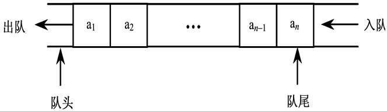

# 算法

## 栈和队列

::: tip 栈和队列

​		几乎所有的编程语言都原生支持数组类型，因为数组是最简单的内存数据结构。javascript也有数组类型，而数组呢，其实就是一种特殊的栈或是队列，利用javascript **Array**所内置的API可以很方便的模拟栈和队列。

::: 

### 栈

::: tip 栈

在计算机科学中, 一个 **栈(stack)** 是一种抽象数据类型,用作表示元素的集合,具有两种主要操作:

- **push**, 添加元素到栈的顶端(末尾);
- **pop**, 移除栈最顶端(末尾)的元素.

以上两种操作可以简单概括为“后进先出(LIFO = last in, first out)”。

此外,应有一个 `peek` 操作用于访问栈当前顶端(末尾)的元素。

"栈"这个名称,可类比于一组物体的堆叠(一摞书,一摞盘子之类的)。

::: 

栈的 push 和 pop 操作的示意：


#### 栈的创建

我们需要给栈声明一些方法：

- **push**(element):添加一个或是几个新元素到栈顶。
- **pop**():移除栈顶的元素，同时返回被移除元素。
- **peek**():返回栈顶的元素，但并不对栈顶的元素做出任何的修改。
- isEmpty():检查栈内是否有元素，如果有返回true，没有返回false。
- clear():清除栈里的元素。
- size():返回栈的元素个数。
- print():打印栈里的元素。

#### 栈的完整代码

我们通过javascript提供的API，实现栈如下：

```js
function Stack() {

    var items = [];

    this.push = function(element){
        items.push(element);
    };

    this.pop = function(){
        return items.pop();
    };

    this.peek = function(){
        // 获取栈顶元素
        return items[items.length-1];
    };

    this.isEmpty = function(){
        return items.length == 0;
    };

    this.size = function(){
        return items.length;
    };

    this.clear = function(){
        items = [];
    };

    this.print = function(){
        console.log(items.toString());
    };

    this.toString = function(){
        return items.toString();
    };
}
```

#### 使用栈

创建完了栈，也给他了方法，然后我们来实例化一个对象：

```js
var stack=new Stack();
console.log(stack.isEmpty());
//true
stack.push(1);
stack.push(3);
//添加元素
console.log(stack.peek());
//输出栈顶元素3
console.log(stack.size());
//2
//输出元素个数复制代码
```

### 队列

::: tip 队列

- 在计算机科学中, 一个 **队列(queue)** 是一种特殊类型的抽象数据类型或集合。集合中的实体按顺序保存。

- 队列基本操作有两种: 向队列的后端位置添加实体，称为入队，并从队列的前端位置移除实体，称为出队。
- 队列中元素**先进先出** FIFO (first in, first out)的示意

::: 



#### 队列的创建

接下来声明一些队列可用的方法：

- enqueue(element):向队列尾部添加一个（或是多个）元素。
- dequeue():移除队列的第一个元素，并返回被移除的元素。
- front():返回队列的第一个元素——最先被添加的也是最先被移除的元素。队列不做任何变动。
- isEmpty():检查队列内是否有元素，如果有返回true，没有返回false。
- size():返回队列的长度。
- print():打印队列的元素。

#### 队列的完整代码

我们通过javascript提供的API，实现队列如下：

```js
function Queue() {

    var items = [];

    this.enqueue = function(element){
        items.push(element);
    };

    this.dequeue = function(){
        return items.shift();
    };

    this.front = function(){
        return items[0];
    };

    this.isEmpty = function(){
        return items.length == 0;
    };

    this.clear = function(){
        items = [];
    };

    this.size = function(){
        return items.length;
    };

    this.print = function(){
        console.log(items.toString());
    };
}
```

#### 使用队列

创建完了队列，也给他了方法，然后我们来实例化一个对象：

```js
var queue=new Queue();
console.log(queue.isEmpty());
//true
queue.enqueue(1);
queue.enqueue(3);
//添加元素
console.log(queue.front());
//返回队列的第一个元素1
console.log(queue.size());
//2
//输出元素个数
```