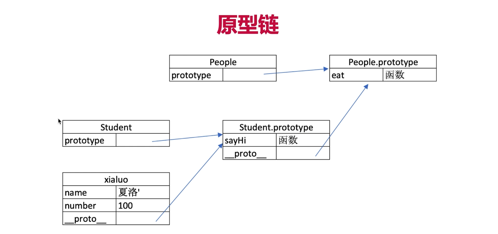
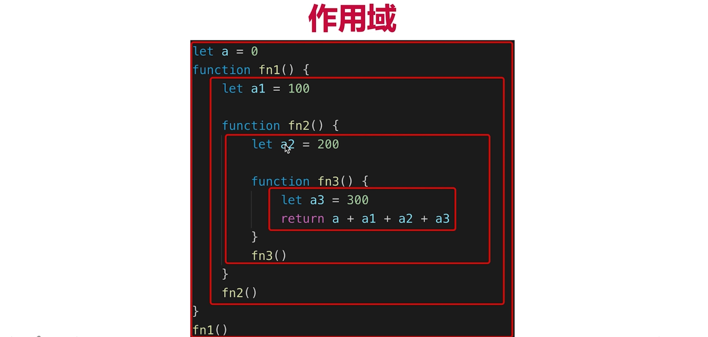

# JavaScript基础

## 函数声明和函数表达式

```js
var f = function () {
  console.log("var");
}

function f() {
  console.log("function");
}
f();
```

- 函数声明提升**声明**和**赋值**  `function fn() { ... }`
- 函数表达式同变量声明，只有声明提前
- 函数声明提升优先于变量声明提升

因此上面代码预编译会做类似如下处理：

```js
/* 预编译阶段
 *函数声明提前优先级别更高，先进行预编译,并对f进行了赋值。
 *在预编译阶段后于函数声明，f经历两次赋值，后来的赋值替代了原先的赋值，表现为f执行函数表达式。
 */
 
//函数声明预编译阶段
var f;
f = function () {
  console.log("function");
}
//函数表达式提前预编译,由于它是变量声明，变量声明提前是只有声明提前，而没有赋值提前。
//重复的声明，js会忽略
var f;
/*执行阶段*/
//变量f再次赋值
f = function () {
  console.log("var");
}
f();  //=>"var"
```


## 变量类型和引用类型

- JS基础知识，规定语法（ECMA262标准）
- JS Web API，网页操作的API（W3C标准）

### 值类型和引用类型

```javascript
// 值类型
let a = 100
let b = a
a = 200
console.log(b)  // b = 100

// 引用类型(现象：相互影响)
let a = {age: 20}
let b = a
b.age = 21
console.log(a.age)   // 21
```

- 栈：从上往下增加
- 堆：从下往上增加

| 栈   |       |      | 栈   |       |      | 栈   |       |
| ---- | ----- | ---- | ---- | ----- | ---- | ---- | ----- |
| key  | value |      | key  | value |      | key  | value |
| a    | 100   |      | a    | 100   |      | a    | 200   |
|      |       |      | b    | 100   |      | b    | 100   |


| 栈   |           |      | 栈   |           |      | 栈   |           |
| ---- | --------- | ---- | ---- | --------- | ---- | ---- | --------- |
| key  | value     |      | key  | value     |      | key  | value     |
| a    | 内存地址1 |      | a    | 内存地址1 |      | a    | 内存地址1 |
|      |           |      | b    | 内存地址1 |      | b    | 内存地址1 |

|           |             |      |           |             |      |           |            |
| --------- | ----------- | ---- | --------- | ----------- | ---- | --------- | ---------- |
| 内存地址1 | { age: 20 } |      | 内存地址1 | { age: 20 } |      | 内存地址1 | { age: 21} |
| key       | value       |      | key       | value       |      | key       | value      |
| **堆**    |             |      | **堆**    |             |      | **堆**    |            |

- 值类型的占用空间少，直接复制快；

- 引用类型有的时候占用类型会很大，直接复制会导致存储空间太大，而且直接复制可能会很慢

常见的值类型

```javascript
let a  // undefined
const s = 'abc'
const n = 100
const b = true
const s = Symbol('s')
```

常见的引用类型

```javascript
const obj = { x: 100 }
const arr = ['a', 'b', 'c']

const n = null  // 特殊引用类型，指针指向为空地址

// 特殊引用类型，但不用于存储数据，所以没有“拷贝、复制函数”一说
function () {}
```

### typeof运算符和深拷贝

- typeof

type能判读哪些类型：1.识别所以的值类型； 2.识别函数；  3.判断是否是引用类型

```javascript
// 判断所有值类型
let a;                   		typeof a   // 'undefined'
const str = 'abc';				typeof str // 'string'				
const n = 100;					typeof n   // 'number'
const b = true;					typeof b   // 'boolean'
const s = Symbol('s')			typeof s   // 'symbol'

// 能判断函数
typeof console.log()   // 'function'
typeof function(){}    // 'function'

// 能识别引用类型 （不能再继续识别）
type null              // 'object'
type ['a','b']         // 'object'
type { age: 20}        // 'object'
```

- 简单深拷贝
  1. 注意判断是值类型还是引用类型
  2. 注意判断是数组还是对象
  3. 递归

```javascript
function deepClone( obj = {}) {
    if(typeof(obj) !=='object' || typeof(obj) == null) {
        // obj是null,或者不是对象和数组，直接返回
        return obj
    }
    
    // 初始化返回结果
    let result
    if (obj instanceof Array) {
        result = []
    } else {
        result = {}
    }
    
    for (key in obj) {
        // 保证key不是原型的属性
        if(obj.hasOwnProperty(key)) {
            // 递归调用
            result[key] = deepClone(obj[key])
        }
    }
    
    return result
}
```

### 浅拷贝

浅拷贝的几种实现方法

1. 利用`Object.assign()`方法
2. 利用`...`扩展运算符

**第一种方法：** `Object.assign()`会拷贝原始对象中的所有属性到一个新对象上，如果属性为对象，则拷贝的是对象的地址，改变对象中的属性值，新拷贝出来的对象依然会受影响。

```js
var obj = {
  name: '张三',
  age: 23,
  isStudent: false,
  job: {
    name: 'FE',
    money: 12
  }
}
var newObj = Object.assign({}, obj);
obj.job.money = 21;
console.log(newObj.name);     // 输出张三
console.log(newObj.age);      // 输出23
console.log(newObj.job.money);// 输出21，受影响
```

**第二种方法：**`...`扩展运算符是`ES6`新增加的内容

```js
var obj = {
  name: '张三',
  age: 23,
  isStudent: false
}
var newObj = {...obj};
console.log(newObj.name);     // 输出张三
console.log(newObj.age);      // 输出23
```

### 深拷贝几种实现方式

1. 配合使用`JSON.parse()`和`JSON.stringify()`两个函数(局限性比较大)
2. 实现自己的简易深拷贝方法
3. `lodash`第三方库实现深拷贝

**第一种方法：** 利用`JSON`的序列化和反序列化方法，可以实现简易对象深拷贝，但此种方法有较大的限制：

1. 会忽略属性值为`undefined`的属性
2. 会忽略属性为`Symbol`的属性
3. 不会序列化函数
4. 不能解决循环引用的问题，直接报错

```js
var obj = {
  name: '张三',
  age: 23,
  address: undefined,
  sayHello: function() {
    console.log('Hello');
  },
  isStudent: false,
  job: {
    name: 'FE',
    money: 12
  }
}
var newObj = JSON.parse(JSON.stringify(obj));
obj.job.money = 21;
console.log(newObj.name);      // 输出张三
console.log(newObj.age);       // 输出23
console.log(newObj.job.money); // 输出12

console.log(newObj.address);   // 报错
console.log(newObj.sayHello());// 报错
```

**第二种：** 实现自己简易的深拷贝函数

```js
function deepClone(obj) {
  function isObject(o) {
    return (typeof o === 'object' || typeof o === 'function') && o !== null;
  }
  if(!isObject(obj)) {
    throw new Error('非对象');
  }
  var isArray = Array.isArray(obj);
  var newObj = isArray ? [...obj] : {...obj};
  Reflect.ownKeys(newObj).forEach(key => {
    newObj[key] = isObject(newObj[key]) ? deepClone(newObj[key]) : newObj[key];
  })
  return newObj;
}
var obj = {
  name: 'AAA',
  age: 23,
  job: {
    name: 'FE',
    money: 12000
  }
}
var cloneObj = deepClone(obj);
obj.job.money = 13000;
console.log(obj.job.money);     // 输出13000
console.log(cloneObj.job.money);// 输出12000
```

**第三种方法：** 使用[lodash](https://lodash.com/docs#cloneDeep)第三方函数库实现(需要先引入lodash.js)

```js
var obj = {
  name: '张三',
  age: 23,
  isStudent: false,
  job: {
    name: 'FE',
    money: 12
  }
}
var newObj = _.cloneDeep(obj);
obj.job.money = 21;
console.log(newObj.name);     // 输出张三
console.log(newObj.age);      // 输出23
console.log(newObj.job.money);// 输出12，不受影响
```

### 变量计算

- 字符串拼接

```javascript
const a = 100 + 10          // 110
const b = 100 + '10'        // '10010'    100+parseInt('10') === 110
const c = true + '10'       // 'true10'
```

- ==运算符

```javascript
// true
100 == '100'    
0 == ''
0 == false
fase == ''
null == undefined

// 除了 == null 之外，其他一律用 === ，例如

const obj = { x: 100 }
if(obj.a == null) {}
// 相当于:
// if (obj.a === null || obj.a === undefined) {}
```

- if语句和逻辑运算

1. truly变量： !!a === true 的变量
2. falsely变量： !!a === false 的变量

truly和falsely变量是经过两步取反后为true或者false的变量

```
// 一下是 falsely变量。 除此之外都是truely变量
!!0 === false
!!NaN === false
!!'' === false
!!null === false
!!undefined === false
!!false === false
```

- 逻辑判断

```javascript
console.log(10 && 0)            // 0
console.log('' || 'abc')        // 'abc'
console.log(!window.abc)        // true
```

## 原型和原型链

JavaScript是一个基于原型继承的，ES6的class其实也是原型继承

### class和继承

- constructor
- 属性
- 方法

```javascript
class Student {
    constructor (name,number) {
        this.name = name
        this,number = number
    }
    sayHi () {
        console.log(`姓名 ${this.name}, 学号 ${this.number}`)
    }
}

// 通过类 new 实例/对象
const caffrey = new Student('caffrey', 18)
console.log(caffrey.name)
console.log(caffrey.number)
caffrey.sayHi()
```

- class继承(extends)

```javascript
// 父类
class People {
    constructor (name) {
        this.name = name
    }
    eat() {
        console.log(`${this.name} eat a log`)
    }
}

// 子类
class Student extends People {
    constructor(name,number) {
        super(name)
        this.age = number
    }
    sayHi () {
        console.log(`姓名 ${this.name}, 学号 ${this.number}`)
    }
}

// 通过类 new 实例/对象
const caffrey = new Student('caffrey', 18)
console.log(caffrey.name)
console.log(caffrey.number)
caffrey.eat()
caffrey.sayHi()
```

### 原型

- 类型判断 - instanceof

```javascript
caffrey instanceof Student    // true
caffrey instanceof People     // true
caffrey instanceof Object     // true

[] instanceof Array     // true
[] instanceof Object    // true

{} instanceof Object    // true
```

- 原型

```
// class 实际上是函数， 可见是语法糖
typeof People   // 'function'
typeof Student   // 'function'

// 隐式原型和显式原型
console.log( caffrey.__proto__ )
console.log( Student.prototype )
console.log( caffrey.__proto === Student.prototype )    // true
```


- **原型关系**

1. 每个class都有显式原型
2. 每个实例都有隐式原型
3. 实例的隐式原型指向对应 class 的prototype(显式原型)

- **基于原型的执行规则**

1. 获取属性 caffrey.name 或执行方法 caffrey.sayHi( )时
2. 现在自身属性和方法寻找
3. 如果找不到则自动去隐式原型中寻找

### 原型链和instanceof

**实例的隐式原型指向构造函数的显式原型**

```
// student继承于People  
console.log( Student.prototype.__proto__ )
console.log( People.prototype )
console.log( Student.prototype.__proto__ === People.prototype )    // true
```



- **hasOwnProperty**

hasOwnProperty方法是继承自Object的

```javascript
// hasOwnProperty检测是不是自身属性（非继承）
caffrey.name                            // 'caffrey'
caffrey.hasOwnProperty('name')          // true

caffrey.sayHi()                         // '姓名 caffrey , 学号 18'
caffrey.hasOwnProperty('sayHi')         // false
caffrey.hasOwnProperty('eat')           // false
```


- **instanceof**

实例沿着隐式原型链往上寻找，如果隐式原型能对应到class(构造函数)的显示原型，则返回true,否则返回false


1. class是ES6语法规范，由ECMA委员会发布
2. ECMA只规定语法规则，即我们的代码的书写规范，不规定如何实现
3. 以上实现方式都是V8引擎（yinqing）的实现方式，也是主流的

### 回顾

- 手写一个简易的jQuery,考虑插件和扩展性

```javascript
class jQuery {
    constructor(selector) {
        const result = document.querySelectorAll(selector)
        const length = result.length
        for(let i =0; i<length; i++) {
            this[i] = result[i]
        }
        this.length = length
        this.selector = selector
    }
    get(index) {
        return this[index]
    }
    each(fn) {
        for(let i =0; i<length; i++) {
            const elem = this[i]
            fn(elem)
        }
    }
    on(type, fn) {
        return this.each(elem => {
            elem.addEventListener(type, fn, false)
        })
    }
    ......
}
    
// 插件
   	jQuery.prototype.dialog = function (info) { alert(info) }
// "造轮子"
	class myJQuery extends jQuery {
        constructor(selector) {
            super(selector)
        }
        // 扩展自己的方法
        addClass(className) {
            ...
        }
    }
    
//  const $p = new jQuery('p')
//  $p.get(1)
//  $p.each(elem=> console.log(elem.nodeName))
//  $p.on('click',()=>alert('clicked'))
```

## 作用域和闭包

### 作用域和自由变量



- **作用域**

代表了一个变量的合法使用范围，超出范围使用则报错

1. 全局作用域
2. 函数作用域
3. 块级作用域（ES6新增）

```
// 块级作用域 { }  let/const
if (true) {
	let x = 100
}
console.log(x)  // 会报错
```

- **自由变量**

1. 一个变量在当前作用域没有**定义**，但被使用了
2. 向上级作用域，一层一层依次寻找，直到找到为止
3. 如果到了全局作业域，则报错 ××× not defined

### 闭包

- 作用域应用的特殊情况，有两种表现（函数的声明和调用不在一个位置）
- 函数作为参数被传递
- 函数作为返回值被返回

```javascript
// 函数作为返回值
function create() {
	const a = 100
	return function () {
		console,log(a)
	}
}

const fn = create()
const a = 200
fn()  // 100   在create作用域声明，在全局作用域执行

```

```javascript
// 函数作为参数被传递
function print (fn) {
	const a = 200
	fn ()
}
const a = 100
function fn() {
	console.log(a)
}
print(fn)  // 100  在全局作用域声明，在print作用域执行
```

所有的自由变量的查找： 是在**定义**的地方，向上级作用域查找，不是在执行的地方！！

### this

- 作为普通函数
- 使用call apply bind （改变this指向）
- 作为对象方法被调用
- 在class方法中调用
- 箭头函数

this取什么值，是在函数**执行**的时候确认的，不是在函数定义的时候确认的(除了箭头函数)

```javascript
function fn1 {
	console.log(this)
}

fn1()   // window

// 区别：call可以直接调用，bind返回一个新的函数来执行
fn1.call({x:100})     // {x: 100}

const fn2 = fn1.bind({x:200})
fn2()   // {x:200}
```

- **setTimeout中的this**

《JavaScript高级程序设计》第二版中，写到：“超时调用的代码都是在全局作用域中执行的，因此函数中this的值在非严格模式下指向window对象，在严格模式下是undefined”。

```javascript
const zhangsan = {
	name: '张三'，
	sayHi() {
		// this 即当前zhangsan对象
		console.log(this)
	}
	wait () {
		setTimeout (function () {
			// this === window,这个函数被执行是setTimeout本身被触发的执行，它并不是						// zhangsan.sayHi()这种方式的执行，作为一个普通函数被执行
			console.log(this)
		})
	}
}
```

**箭头函数**的this永远是取它**上级作用域**的this

```javascript
const zhangsan = {
	name: '张三'，
	sayHi() {
		// this 即当前zhangsan对象
		console.log(this)
	}
	wait () {
        // this 即当前zhangsan对象
		setTimeout (()=> {
			// this 即当前zhangsan对象
			console.log(this)
		})
	}
}
```

**class**中的this

```javascript
class People {
	constructor(name) {
		this.name = name
		this.age = 20
	}
	sayHi () {
		console.log(this)
	}
}
const cc = new People('caffrey')
cc.sayHi()   // cc 对象
```

- Tips:

  ```js
  // sayHi是对象方法，this指向caffrey
  caffrey.sayHi()               // name caffrey, age 18
  
  // 此时是隐式原型的对象方法，没有name和number,sayHi方法是在隐式原型中查找的
  caffrey.__proto__.sayHi()     // name undefined, age undefined
  ```

  

### 实例

#### bind函数

- bind函数的使用

```js
function fn1(a, b) {
    console.log('this', this)
    console.log(a, b)
    return 'this is fn1'
}

const fn2 = fn1.bind({x: 100},10,20)
const res = fn2()    // this {x: 100}; 10 20
console.log(res)	 // this is fn1
```

- 手写bind函数

```js
Function.prototype.bind1 = function() {
    // 将参数拆解为数组
    const args = Array.prototype.slice.call(arguments)
    
    // 获取this(数组的第一项)
    const t = args.shift()
    
    // fn1.bind(...) 中的 fn1
    const self = this
    
    // 返回一个函数
    return function () {
        return self.apply(t,args)
    }
}
```

#### 闭包的应用

- 隐藏数据

```js
function createCache () {
    const data = {}
    return {
        get: function(key) {
            return data[key]
        },
        set: function(key,value) {
            data[key] = value
        }
    }
}

const c = createCache ()
c.set('a',100)
c.get('a')       // 100
```

- 创建10个a标签，点击弹出对应值

```js
let a
// i在块级作用域内
for(let i=0;i<10,i++) {
    a = document.createElement('a')
    a.innerText = i +'<br>'
    a.addEventListener('click',function(e){
        e.preventDefault()
        alert(i)
    })
    document.body.appendChild(a)
}
```

- apply和call的区别

JavaScript中的每一个Function对象都有一个apply()方法和一个call()方法，它们的语法分别为：

```js
/*apply()方法*/
function.apply(thisObj[, argArray])

/*call()方法*/
function.call(thisObj[, arg1[, arg2[, [,...argN]]]]);
```

#### call、apply、bind

- **手写Call**

```js
Function.prototype.myCall = function(context) {
  if(typeof this !== 'function') {
    throw new TypeError('error');
  }
  context = context || window;
  context.fn = this;
  var args = [...arguments].slice(1);
  var result = context.fn(...args);
  delete context.fn;
  return result;
}
function foo(){
  console.log(this.age);
}
var obj = {
  age: 101
}
foo.myCall(obj); // 输出 101
```

- **手写apply**

```js
手写apply
// 手写
Function.prototype.myApply = function(context) {
  if(typeof this !== 'function') {
    throw new TypeError('error');
  }
  context = context || window;
  context.fn = this;
  var result = arguments[1] ? context.fn(...arguments[1]) : context.fn();
  delete context.fn;
  return result;
}
function foo(){
  console.log(this.age);
}
var obj = {
  age: 101
}
foo.myApply(obj); // 输出101
```

- **手写bind**

```js
Function.prototype.myBind = function(context) {
  if(typeof this !== 'function') {
    throw TypeError('error');
  }
  const self = this;
  const args = [...arguments].slice(1);
  return function F() {
    if(this instanceof F) {
      return new self(...args, ...arguments);
    }
    return self.apply(context, args.concat(...arguments));
  }
}
function foo() {
  console.log(this.age);
}
var obj = {
  age: 121
}
var newFunc = foo.myBind(obj);
newFunc(); // 输出121
```

## 异步

### 同步和异步的区别

#### 单线程

- JavaScript是单线程语言，只能同时做一件事

作为浏览器脚本语言，JavaScript 的主要用途是与用户互动，以及操作 DOM。这决定了它只能是单线程，否则会带来很复杂的同步问题。比如，假定JavaScript 同时有两个线程，一个线程在某个 DOM 节点上添加内容，另一个线程删除了这个节点，这时浏览器应该以哪个线程为准？

所以，为了避免复杂性，从一诞生，JavaScript 就是单线程，这已经成了这门语言的核心特征，将来也不会改变。

- 浏览器和nodejs已支持JS启动进程，如 Web Worker

为了利用多核 CPU 的计算能力，HTML5 提出 Web Worker 标准，允许 JavaScript 脚本创建多个线程，但是子线程完全受主线程控制，且不得操作 DOM。所以，这个新标准并没有改变 JavaScript 单线程的本质。

- JS和DOM渲染共用同一个线程，因为JS可修改DOM结构

#### 异步

（异步的背景就是单线程：同时只能做一件事）

- 遇到等待（网络请求，定时任务）不能卡住
- 需要异步
- 回调callback函数形式

```js
// 异步 (callback回调函数)
console.log(100)
setTimeout(function() {
    console.log(200)
}, 1000)
console.log(300)        // 100 300 200

// 同步 （卡住）
console.log(100)
alert(200)
console.log(300) 
```

#### 区别

- 基于JS是单线程语言
- 异步不会阻塞代码的执行
- 同步会阻塞代码的执行

### 异步应用场景

1. 网络请求，如ajax图片加载
2. 定时任务，如setTimeout

```js
// ajax
console.log('start')
$.get('src', function(res) {
	console.log(res)
})
console.log('end')

// 图片加载
console.log('start')
let img = document.createElement('img')
// onload callback
img.onload = function () {
    console.log('loaded')
}
img.src = '/***.png'
console.log('end')
```

### Promise

callback hell回调地狱

```js
// 获取res1
$.get(url1, (res1) => {
	console.log(res1)
    
	// 获取res2
	$.get(url2, (res2) => {
        console.log(res2)
        
        // 获取res3
        $.get(url3, (res3) => {
            console.log(res3)
            
            ......
        })
    })
})
```

Promise

```js
function getData (url) {
    // 返回一个Promise函数，函数参数是一个函数
    return new Promise((resolve, reject) => {
       	$.ajax({
            url,
            success(data) {
                resolve(data)
            },
            error(err) {
                reject(err)
            }
        })                
    })
}

const url  = '/data1.json'
const url  = '/data2.json'
const url  = '/data3.json'
getData(url1).then(data1 => {
    console.log(data1)
    return getData(url2)
}).then(data2 => {
    console.log(data2)
    return getData(url3)  
}).then(data3 => {
    console.log(data3) 
}).catch(err => console.error(err))
```

- 手写promise加载一张图片

```js
const url = "http://demo1.jinrui.kooboo.site/aironepage/HTML/img/1920x1080/01.jpg"

function loadImg (src) {
    // new Promise返回一个函数，两个参数也是函数
    return new Promise((resolve,reject) => {
        const img = document.createElement('img')
        img.onload = () => {
            resolve(img)
        }
        img.onerror =() => {
            const err = new Error('图片加载失败 '+src)
			reject(err)
        }
		img.src = src
    })
}

loadImg(url).then(img => {
    console.log(img.width)
    // return 的img会被传递到第二个then
    return img
}).then(img => {
    console.log(img.height)
}).catch(err => console.log(err))            // 1920 1080
```

```js
const url1 = '...'
const url1 = '...'

loadImg(url).then(img1 => {
    console.log(img1.width)
    // 返回img对象
    return img1
}).then(img1 => {
    console.log(img1.height)
    // 返回Promise实例
    return loadImg(url2)
}).then(img2) => {
    console.log(img2.width)
    return img2
}).then(img2) => {
    console.log(img2.height)
})
```

- setTimeout笔试题

```js
console.log(1)
setTimeout(function() {
    console.log(2)
}, 1000)
console.log(3)
// 只要是异步就会延迟执行
setTimeout(function() {
    console.log(4)
}, 0)
console.log(5)             // 1 3 5 4 2
```

# JS Web API

## DOM

- DOM
- BOM
- 事件绑定
- ajax
- 存储

### DOM的本质

Document Object Model

​		**xml**可扩展的一种语言，可以描述任何结构化的数据。

note这里是一封信，从谁发，发给谁，标题，主体。

结构树，从主干到分支。标签名字可以自定义，只要标签闭合就好了。HTML是xml一种特殊结构。

​		**HTML**遵循W3C规定一种特殊的XML。各种规定，必须先写什么，怎么写什么。

如果是一个字符串对象的话，让浏览器，js处理是非常不方便的。比如何如查询，如何操作等等比较麻烦。所以浏览器拿到代码之后，就是通过DOM把HTML结构化成浏览器和JS可以识别的东西，浏览器和js就比较容易处理。那么"如何结构化对象"呢？就是Document object model。有了结构化的树和相关规定，就很容易处理。DOM就是把传来的字符串给结构化了。

### DOM节点操作

```js
const div1 = document.getElementById('div1')   // 元素 
const divList = document.getElementsByTagName('div')   // 集合
console.log(div1)
console.log(divList[0])

const containerList = document.getElementByClassName('.container')   // 集合
const pList = document.querySelectorAll('p')       //集合   NodeList(n)
```

- #### DOM节点的property

通过js属性操作（property是js对象的一个属性）

```js
const pList = document.querySelectorAll('p')       //集合   NodeList(n)
const p1 = pList[0]             // <p>text</p>   本质是一个对象
console.log(p1.style.width)     // 获取样式       style是p的一个对象属性
p1.style.width = '100px'  
p1.className = 'red'  
// 修改样式       <p style="width: 100px;" class="red">text</p>
console.log(p1.className)       // 获取class     class是个关键字
p1.className = 'p1'			   // 修改class

//获取nodeName 和 nodeType
console.log(p.nodeName)
console.log(p.nodeType)
```

- #### attribute

```js
p1.setAttribute('data-name', 'imooc')     // <p data-name="imooc">text</p>
p1.getAttribute('data-name')              // imooc
```

- #### 区别

1. property: 修改对象属性，不会体现到html结构中（better)
2. attribute: 修改html属性，会改变html结构 
3. 两者都有可能引起DOM的重新渲染

### DOM结构操作

```js
const div1 = document.getElementById('div1')
// 创建、添加节点
const p1 = document.createElement('p1')
p1.innerHTML = 'this is p1'
div1.appendChild(p1)

// 移动已有的节点   移动！
const p2 = document.getElementById('p2')
div1.appendChild(p2)

// 获取父元素
console.log(p1.parentNode)

// 获取子元素列表  NodeList
console.log(div1.childNodes)
// div1.childNodes[n].nodeName        #text p ...
// div1.childNodes[n].nodeType        3     1 ...

// 将NodeList转化为数组   Array.prototype.slice.call(arr)
// 过滤出nodeType为1的节点
const div1ChildNodesP =  Array.prototype.slice.call(div1.childNodes).filter(item => {
    return item.nodeType === 1
})

// 删除节点
div1.removeChild(div1ChildNodesP[0])
```

### DOM性能

1. DOM操作非常“昂贵” ，避免频繁的DOM操作
2. 对DOM查询做缓存
3. 将频繁操作改为一次性操作

- #### DOM查询做缓存

  ```js
  // 不缓存DOM查询结果
  for(let i=0,i<document.getElementByTagName('p').length;i++){
      // 每次循环都会计算length, 频繁进行DOM查询
  }
  
  // 缓存DOM查询结果
  const pList = document.getElementByTagName('p')
  const length = pList.length
  for(let i=0,length;i++){
      // 缓存length, 只进行一次DOM查询
  }
  ```

- #### 将频繁操作改为一次性操作

  ```js
  const listNode = document.getElementById('list')
  // 创建一个文档片段，此时还没有插入到DOM树中
  const frag = document.createDocumentFragment()
  // 执行插入
  for(let x=0;x<10;x++) {
      const li = document.createElement('li')
      li.innerHTML = "List Item "+ x
      frag.appendChild(li)
  }
  // 都完成之后，在插入到DOM树当中
  listNode.appendChild(frag)
  ```


## BOM

- navigator
- screen
- location
- history

1. ##### 识别浏览器类型

2. ##### 分析拆解url各个部分

```js
// navigator  网络：详细的浏览器检查方案
const ua = navigator.userAgent
const isChrome = us.inexOf('Chrome')
console.log(isChrome)

// screen
screen.width/height

// location   https://www.youtube.com/watch?v=YQHsXMglC9A
    location = {
    origin: "https://www.youtube.com"
    protocol: "https:"
    host: "www.youtube.com"
    hostname: "www.youtube.com"
    port: ""
    pathname: "/watch"
    search: "?v=YQHsXMglC9A"
    hash: ""     （#之后的内容）
    href: "https://www.youtube.com/watch?v=YQHsXMglC9A"
}

// history
history.back()
history.forward()
```

## 事件

### 事件绑定

```js
// 事件绑定
const btn = document.getElementById('btn1')
btn.addEventListener('click',event => {
    console.log('click')
})

// 通用事件绑定函数
function bindEvent(ele,type,selector,fn) {
    if(fn==null) {
        fn = selector
        selector = null
    }
    ele.addEventListener(type, event => {
        const target = event.target
        if(selector) {
            // 代理绑定
            if(target.matches(selector)) {
                fn.call(target,event)
            }
        } else {
            fn.call(target,event)
        }
    })
}

const div1 = document.getElementById('pdiv1')
const p1 = document.getElementById('p1')
// 普通绑定
bindEvent(p1,'click', function (e) {
    e.preventDefault()
    alert(this.inierHTML)
})

// 代理绑定
bindEvent(div1,'click','a', function (e) {
    e.preventDefault()
    alert(this.inierHTML)
})

// 箭头函数 this这里指向上级作用域window
bindEvent(div1,'click','a', e => {
    e.preventDefault()
    alert(e.target.inierHTML)
})
```

### 事件冒泡

::: tip 

1. 基于DOM树形结构
2. 事件会顺着触发元素往上冒泡
3. 应用场景： 代理

:::

```html
<body>
	<div id='div1'>
        <p id='p1'>激活</p>
        <p id='p2'>取消</p>
        <p id='p3'>取消</p>
        <p id='p4'>取消</p>
    </div>
    <div id='div2'>
        <p id='p5'>激活</p>
        <p id='p6'>取消</p>
    </div>
</body>
```

```js
const p1 = document.getElementById('p1')
const body = document.body
bundEvent(p1,'click',e => {
    console.log(e.target)   // 获取触发的元素
    e.stopPropagation()     // 阻止冒泡
    alert('p1')
})
bindEvent(body,'click',e => {
    console.log('body clicked')  
})
```

事件的触发类似于**冒泡**，会沿着html结构一级一级向上触发。

除了id为p1的p标签阻止了事件的冒泡`e.stopPropagation()` ，这里body、div、p标签的点击都会触发body这个事件绑定函数。

### 事件代理

```html
<div id='div1'>
    <a href="#">a1</a>
    <a href="#">a2</a>
    <a href="#">a3</a>
    <a href="#">a4</a>
    <button>button</button>
</div>
```

```js
const div1 = document.getElementById('div1')
div1.addEventListener('click', e=> {
    e.preventDefault()
    const target = e.target
    if(e.nodeName === 'A') {
        alert(target.innerHTML)
    }
})
```

在外层div上绑定点击事件，每个a标签由于事件的冒泡机制，在点击时都会触发该绑定事件。

::: tip 

1. 代码简介
2. 减少浏览器内存占用
3. 但是，不要滥用

:::

## ajax

### XMLHttpRequest

 实例化/open接口信息/监听状态变化函数/发送

```js
// get请求
const xhr = new XMLHttpRequest()
// true 异步请求; false 同步请求
xhr.open('GET','/login',true)
// XMLHttpRequest实例状态改变的时候触发的函数
xhr.onreadystatechange = function () {
    // 这里的函数异步执行
    if(xhr.readyState === 4) {
        if(xhr.status === 200) {
            // JSON.parse(xhr.responseText)
            console.log(xhr.responseText)
        } else {
            consoel.log('其他情况')
        }
    } 
}
xhr.send(null)
```

```js
// post请求
const xhr = new XMLHttpRequest()
xhr.open('POST','/api',true)
xhr.onreadystatechange = function () {
    if(xhr.readyState === 4) {
        if(xhr.status === 200) {
            console.log(xhr.responseText)
        } else {
            consoel.log('其他情况')
        }
    } 
}
const postData = {
	userName: 'caffrey',
	password: 'xxxxxx'
}
// post发送的是一个JSON字符串
xhr.send(JSON.stringify(postData))
```

​		**xhr.readyState**

- 0 - (未初始化)  还没有调用send()方法

- 1 - (载入) 已调用send()方法，正在发送请求

- 2 - (载入完成) send()方法执行完成，已接收到全部的响应内容

- 3 - (交互) 正在解析响应内容

- 4 - (完成) 响应内容解析完成，可在客户端调用

  **xhr.status**

- 2xx - 表示成功处理请求，如200

- 3xx - 需要重定向，浏览器直接跳转，如301(永久重定向)、302(临时重定向)、304(资源未改变，使用缓存)

- 4xx - 客户端请求错误，如404、403

- 5xx - 服务端错误

```js
if(xhr.readyState === 4) {
    if(xhr.status === 200) {
        console.log(xhr.responseText)
    } else if(xhr.status === 404){
        consoel.log('404 not found')
    }
}
```

### 跨域

#### 同源策略

- ajax请求时，**浏览器**要求当前网页和server必须同源（安全）
- 同源：协议、域名、端口，三者必须一致
- 前端：http://a.com:8080/   server：https://b.com/api/xxx 三者都不同

::: tip 加载图片、CSS、JS可无视同源策略

​		``

​		`<link href=跨域的css地址 />`

​		`<script src=跨域的js地址></script>`

:::

- img标签可用于统计打点，可使用第三方统计服务
- link script可用于CDN,CDN一般都是外域
- script可实现JSONP

#### 跨域

- 所有的跨域，都必须经过server端的允许和配合
- 未经server端允许就实现的跨域，说明浏览器有漏洞，危险信号

### JSONP和CORS

- 访问https://xxx.html/,服务端一定返回一个html文件吗？
- 服务器可以任何动态拼接数据返回，只要符合html格式要求
- 同理于`<script src="https://imooc.com/getData.js">`

#### JSONP

::: tip 

​		`<script>`可绕过跨域限制

​		服务器可以任意动态拼接数据返回

​		所以，`<script>`就可以获得跨域的数据，只要服务端愿意返回

:::

```js
// getData.js
abc(
	{name: 'caffrey'}
)
```

```html
<!-- html -->
<script>
	window.abc = function(data) {
    	// 跨域得到的信息
        console.log(data)
}
</script>
<script src="https://imooc.com/getData.js?id=123&callback=abc"></script>
<!--将返回 callback({x:100, y:200})-->
```

**jQuery实现jsonp**

```js
$.ajax({
    url: 'http://localhost:8002/x-origin.json',
    dataType:'jsonp',
    jsonpCallback: 'callback',
    success: function(data) {
        console.log(data)
    }
})
```

#### CORS - 服务器设置http header

```js
// *表示接受所有的地址请求
response.setHeader("Access-Control-Allow-Origin","http://localhost:8011");
response.setHeader("Access-Control-Allow-Header","X-Request-With");
response.setHeader("Access-Control-Allow-Methods","PUT,POST,GET,DELETE,OPTIONS");

// 接收跨域的cookie
response.setHeader("Access-Control-Allow-Credentials","true");
```

### 手写一个简易的ajax

```js
function ajax(url,success) {
	const xhr = new XMLHttpRequest()
	xhr.open("GET",url,true)
	xhr.onreadystatechange = function () {
    if(xhr.readyState === 4) {
        if(xhr.status === 200) {
            success(xhr.responseText)
        }
    }
	xhr.send(null)
}
```

```js
function ajax(url) {
	const promise = new Promise((resolve,reject) => {
        const xhr = new XMLHttpRequest()
        xhr.open("GET",url, true)
        xhr.onreadystatechange = function () {
            if(xhr.readyState === 4) {
                if(xhr.status === 200) {
                    resolve(JSON.parse(xhr.responseText))
                } else if (xhr.status === 404 || xhr.status === 500) {
                    reject(new Error('404 not found'))
                }
            }
        }
        xhr.send(null)
    })
    return promise
}

const url = '/data/test.json'
ajax(url).then(res => console.log(res)).catch(err => console.log(err))
```

### ajax常用的插件

- jQuery

- fetch

- [axios]: https://www.kancloud.cn/yunye/axios/234845

```js
$(function(){
    //请求参数
    var list = {};
    //
    $.ajax({
        //请求方式
        type : "POST",
        //请求的媒体类型
        contentType: "application/json;charset=UTF-8",
        //请求地址
        url : "http://127.0.0.1/admin/list/",
        //数据，json字符串
        data : JSON.stringify(list),
        //请求成功
        success : function(result) {
            console.log(result);
        },
        //请求失败，包含具体的错误信息
        error : function(e){
            console.log(e.status);
            console.log(e.responseText);
        }
    });
});
```

- [Fetch]: https://developer.mozilla.org/zh-CN/docs/Web/API/Fetch_API/Using_Fetch

  ```js
  fetch('http://example.com/movies.json')
  .then(function(response) {
  	return response.json();
  }).then(function(myJson) {
      console.log(myJson);
  });
  ```

## 存储

### cookie

::: tip cookie

​		本身用于浏览器和server通讯，被‘借用’到本地存储

​		前端可通过document.cookie = '...' 来修改

:::

```js
document.cookie = 'a=100';
document.cookie = 'b=200';
document.cookie = 'a=300';

console.log(document.cookie) // a=300;b=200
```

只要页面不清除，页面刷新cookie仍然存在

**缺点**：

1. 最大为4kb
2. http请求时需要发送到服务端，增加请求数据量
3. 只能通过document.cookie = '...' 来修改

### lcoalStorage/sessionStorage

::: tip lcoalStorage和sessionStorage

​		HTML5专门为存储而设计，最大可存5M

​		API简单易用 setTtem getItem

​		不会随着请求被发送出去

:::

```js
localStorage.setItem('a', 100)
localStorage.getItem('a')        // "100"

sessionStorage.setItem('b', '200')
sessionStorage.getItem(b)        // "200"
```

- localStorage数据会永久存储，除非代码或者手动删除
- sessionStorage数据只存在于当前会话，浏览器关闭则清空
- 一般用localStorage会多一些（方便下次访问）

### 区别

1. 容量
2. API易用性
3. 是否跟随http请求发送出去