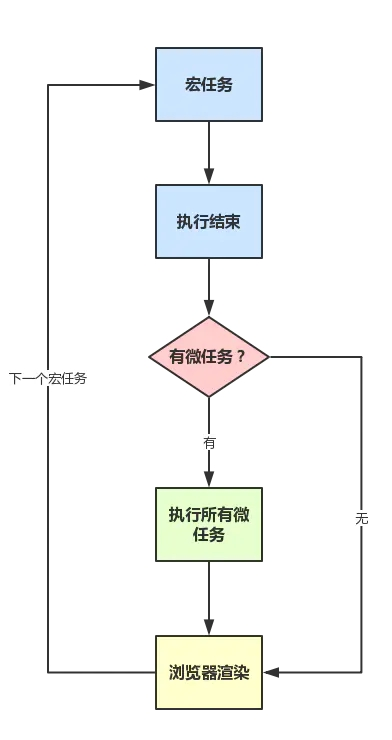

# JavaScript 笔记

## JavaScript 解答

### new 的过程

无论是通过字面量还是通过`new`进行构造函数调用创建出来的对象，其实都一样。调用`new`的过程如下：

1. 创建一个新对象
2. 原型绑定
3. 绑定 this 到这个新对象上
4. 返回新对象

### this 全解析

`JavaScript`中的`this`只有如下几种情况，并按他们的优先级从低到高划分如下：

1. 独立函数调用，例如`getUserInfo()`，此时`this`指向全局对象`window`
2. 对象调用，例如`stu.getStudentName()`，此时`this`指向调用的对象`stu`
3. `call()`、`apply()`和`bind()`改变上下文的方法，`this`指向取决于这些方法的第一个参数，当第一个参数为`null`时，`this`指向全局对象`window`
4. 箭头函数没有`this`，箭头函数里面的`this`只取决于包裹箭头函数的第一个普通函数的`this`
5. `new`构造函数调用，`this`永远指向构造函数返回的实例上，优先级最高。

```js
var name = 'global name';
var foo = function() {
  console.log(this.name);
};
var Person = function(name) {
  this.name = name;
};
Person.prototype.getName = function() {
  console.log(this.name);
};
var obj = {
  name: 'obj name',
  foo: foo
};
var obj1 = {
  name: 'obj1 name'
};

// 独立函数调用，输出：global name
foo();
// 对象调用，输出：obj name
obj.foo();
// apply()，输出：obj1 name
obj.foo.apply(obj1);
// new 构造函数调用，输出：p1 name
var p1 = new Person('p1 name');
p1.getName();
```


## ES6 module

```js
// a.js  导出多个
export function fn() {
  console.log('fn');
}

export const obj = {
  name: 'zhangsan'
};
```

```js
// b.js  导出多个
function fn1() {
  console.log('fn');
}

const obj1 = {
  name: 'zhangsan'
};

export { fn1, obj1 };
```

```js
// index.js
import { fn, obj } from './a';
import { fn1, obj1 } from './b';
```

- 使用了 default 之后不能用解构赋值

```js
// c.js  导出单个
const obj = {
  data: 'hello c'
};

export default obj;
```

```js
// d.js  导出多个
function fn2() {
  console.log('fn');
}

const obj2 = {
  name: 'zhangsan'
};

export default {
  fn1,
  obj1
};
```

```js
// index.js
import obj from './c';
import d from './d'; // 不能用解构赋值

console.log(d.fn2, d.obj2);
```

## linux 命令

### 本地登录线上地址

```sh
ssh username@192.168.**.**
password: password
```

### 文件操作

```sh
// 查看文件（平铺）
ls
// 查看所有文件 .babel这种.开头的隐藏文件
ls -a
// 查看文件（列表）
ll
// 清屏
clear
// 创建/删除文件夹 -rf  f:force
mkdir foldername
rm -rf folder
// 定位目录
cd dist
// 修改文件名
mv file file
// 移动文件 将当前file移动到上级目录，命名为file
mv file ../file
// 文件拷贝
cp a.js a1.js
// 新建文件
```

```sh
// 删除文件(可以不用 -rf)
rm a.js
// 新建文件
touch a.js
// 新建文件且打开vim(如果文件存在则直接打开)
vi d.js
i (insert输入状态)
esc (退出insert模式)
: w enter  (shift+; , w 写入保存, 回车)
：q  (shift : , q 退出)
// 打开文件,打印出所有数据
cat d.js
// 打开文件,打印出前/后面几行数据
head d.js
tail d.js
// 在package.json文件内查找babel
grep "babel" package.json
```

### VIM 编辑器

- i 进入 insert 写入状态
- 键盘上下左右可移动

- esc 退出状态
- : w 保存
- : q 退出
- : q! 强制退出（不保存）
- vimtutor 查看 vim 编辑器文档

## 运行环境

### 加载资源的过程

- 浏览器根据 DNS 服务器得到域名的 IP 地址
- 向这个 IP 的机器发送 http 请求
- 服务器收到、处理并返回 http 请求
- 浏览器得到返回内容

### 浏览器渲染页面的过程

- 根据 HTML 结构生成 DOM Tree
- 根据 CSS 生成 CSSOM
- 将 DOM 和 CSSOM 整合形成 RenderTree
- 根据 RenderTree 开始渲染和展示
- 遇到`<script>`时，会执行并阻塞渲染

::: tip 

​	从“在浏览器输入域名”到“页面静态资源完全加载”的整个流程

:::

整个过程可以分为几步：

1. 用户输入

   当用户输入关键字并键入回车之后，这意味着当前页面即将要被替换成新的页面，不过在这个流程继续之前，浏览器还给了当前页面一次执行 `beforeunload` 事件的机会，`beforeunload` 事件允许页面在退出之前执行一些数据清理操作，还可以询问用户是否要离开当前页面。

2. `URL` 请求过程

   首先，网络进程会查找本地缓存**是否缓存**了该资源。

   如果有缓存资源，那么直接返回资源给浏览器进程；如果在缓存中没有查找到资源，那么直接进入**网络请求**流程。这请求前的第一步是要进行 `DNS` 解析，以获取请求域名的服务器 `IP` 地址。如果请求协议是 `HTTPS`，那么还需要建立 `TLS` 连接。

   - 其中，`DNS`也有几步缓存：浏览器缓存，`hosts`文件，
   - 如果本地域名解析服务器也没有该域名的记录，则开始递归+迭代解析
   - `TCP`三次握手，`HTTP`。`TLS`握手，`HTTPS`。

   接下来就是利用 `IP` 地址和服务器建立 `TCP` 连接。连接建立之后，浏览器端会构建请求行、请求头等信息，并把和该域名相关的 `Cookie` 等数据附加到请求头中，然后向服务器发送构建的请求信息。

   数据在进入服务端之前，可能还会先经过负责负载均衡的服务器，它的作用就是将请求合理的分发到多台服务器上，这时假设服务端会响应一个 `HTML` 文件。

   首先浏览器会判断状态码是什么，如果是 `200` 那就继续解析，如果 `400` 或 `500` 的话就会报错，如果 `300` 的话会进行重定向，这里会有个重定向计数器，避免过多次的重定向，超过次数也会报错。

   浏览器开始解析文件，如果是 `gzip` 格式的话会先解压一下，然后通过文件的编码格式知道该如何去解码文件。

3. 准备渲染进程

   默认情况下，`Chrome` 会为每个页面分配一个渲染进程，也就是说，每打开一个新页面就会配套创建一个新的渲染进程。

4. 渲染阶段

   文件解码成功后会正式开始渲染流程，先会根据 `HTML` 构建 `DOM` 树，有`CSS`的话会去构建 `CSSOM` 树。如果遇到 `script` 标签的话，会判断是否存在 `async` 或者 `defer` ，前者会并行进行下载并执行 JS，后者会先下载文件，然后等待 `HTML` 解析完成后顺序执行。

   如果以上都没有，就会阻塞住渲染流程直到 `JS` 执行完毕。

`CSSOM` 树和 `DOM` 树构建完成后会开始生成 `Render` 树，这一步就是确定页面元素的布局、样式等等诸多方面的东西

在生成 `Render` 树的过程中，浏览器就开始调用`GPU` 绘制，合成图层，将内容显示在屏幕上了。

### window.onload 和 DOMContentLoaded

```js
window.addEventListener('load', function() {
  // 页面的全资源加载完才会执行，包括图片、视频等
});

window.addEventListener('DOMContentLoaded', function() {
  // DOM 渲染完即可执行，此时图片、视频还可能没加载完
});
```

### 性能优化策略

::: tip **原则**

- 多使用内存、缓存或者其他方法
- 减少 CPU 计算量，减少网络加载耗时
- 使用于所有编程的性能优化--空间换时间

:::

#### 加载资源优化

- 减少资源体积
- 减少访问次数
- 使用更快的网络

1. 静态资源的压缩合并（webpack 生成环境的压缩打包、雪碧图...）
2. 静态资源缓存（contentHash 通过链接名称控制缓存，只有内容改变的时候链接名称才会改变）
3. 使用 CDN 让资源加载更快
4. 使用 SSR 后端渲染，数据直接输出到 HTML 中（SSR 在 vue、React 的应用，php jsp asp 都是后端渲染）

#### 渲染优化

- CSS 放在 head，JS 放在 body 最下面
- 尽早执行操作（如 DOMContentLoaded）
- 懒加载（图片懒加载，下拉加载更多）
- 减少 DOM 查询，对 DOM 查询做缓存
- 减少 DOM 操作，多个操作尽量合并在一起执行
- 事件的节流 throttle、防抖 debounce

```html
// 图片懒加载

<script type="text/javascript">
  var img1 = document.getElementById('img1');
  img1.src = img1.getAttribute('data-realsrc');
</script>
```

```js
// 缓存dom查询
for(let i=0; i<document.getElementByTagName('p').length; i++) {
    ...
}

var pList = document.getElementByTagName('p')
for(let i=0; i<pList.length; i++){
	...
}

// 合并DOM插入
var list = document.getElementById("list")

var frag = document.createDocumentFragment();
for(let i=0; i<10; i++) {
    let li = document.crateElement("li")
    li.innerHTML = "List item "+i
    frag.appendChild(li)
}

list.appendChild(frag)

// 简单事件节流
var textarea = document.getElementById("text")
var timer
textarea.addEventListener("keyup",function() {
    if(timer) {
        clearTimeout(timer)
    }
    timer = setTimeout(function() {
        // 触发change事件
    },200)
})
```

### 防抖和节流

```js
// 防抖 debounce
// 场景：当输入停止一段时间后触发自动搜索
function debounce(fn,delay = 500) {
    // timer是闭包中的变量（函数作为参数返回）
    let timer = null;
    return function() {
        if(timer) {
            timer = null
        }
        timer = setTimeout(()=> {
            fn.apply(this,arguments)
            timer = null
        }, delay)
    }
}

inputElement.addEventListener("keyup", debounce(()=>{
    console.log(inputElement.value)
}))
```

```js
// 节流 throttle
// 场景：拖拽元素时每隔一段时间才显示位置信息，防止触发太频繁
function throttle(fn,delay = 100) {
    let timer = null;
    return function() {
        if(timer) {
            return
        }
        timer = setTimeout(()=> {
            // 传入参数event事件对象
            fn.apply(this,arguments)
            timer = null
        }, delay)
    }
}

div1.addEventListener('drag', throttle(function(e){
    console.log(e.offsetX, e.offsetY)
}))
```

### web前端攻击方式

#### XSS跨站请求攻击

- 一个博客网站，我发布一篇博客，其中签入`<script>`脚本
- 脚本内容：获取cookie，发送到我的服务器（服务器配合跨域）

::: tip XSS预防

- 替换特殊字符，如`<`变为`&lt;` `>`变为`&gt;`
- `<script>`变为`&lt;script&gt;`,直接显示，而不会作为脚本执行
- 前端要替换，后端也要替换
- 可以使用npm xss库

:::

#### XSRF跨站请求伪造

- 你正在购物，看重了某个商品，商品id是100
- 付费接口是xxx.com/pay?id=100, 但是没有任何验证
- 我是攻击者，我看中了id为200的商品
- 我向你发送一封电子邮件，邮件标题很吸引人
- 但是邮件正文隐藏着``
- 你一查看邮件，就帮我购买了id是200的商品

::: tip XSRF预防

- 使用post接口
- 增加验证，例如密码、短信验证码、指纹等

:::

### Event Loop

#### 同步任务和异步任务

- 所有同步任务都在主线程上执行，形成一个执行栈（execution context stack）。
- 主线程之外，还存在一个"任务队列"（task queue）。只要异步任务有了运行结果，就在"任务队列"之中放置一个事件。
- 一旦"执行栈"中的所有同步任务执行完毕，系统就会读取"任务队列"，看看里面有哪些事件。那些对应的异步任务，于是结束等待状态，进入执行栈，开始执行。
- 主线程不断重复上面的第三步。
  主线程从任务队列中读取事件,这个过程是不断循环的,所以整个的**运行机制**称为event loop

#### 宏任务和微任务

- 宏任务(`macro-task`): 可以理解是每次执行栈执行的代码就是一个宏任务（包括每次从事件队列中获取一个事件回调并放到执行栈中执行,每一个宏任务会从头到尾将这个任务执行完毕，不会执行其它）包括整体代码script，setTimeout，setInterval
-  微任务(`micro-task`): 可以理解是在当前 task 执行结束后立即执行的任务 包括Promise.then(非new Promise)，process.nextTick

- 事件的执行顺序，是先执行宏任务，然后执行微任务，这个是基础，任务可以有同步任务和异步任务，同步的进入主线程，异步的进入`Event Table`并注册函数，异步事件完成后，会将回调函数放入`Event Queue`中(宏任务和微任务是不同的`Event Queue`)，同步任务执行完成后，会从`Event Queue`中读取事件放入主线程执行，回调函数中可能还会包含不同的任务，因此会循环执行上述操作。

  ```js
  setTimeout(function() {
      // 整体代码宏任务外的宏任务 (等待当前宏任务执行完)
      console.log('1');
  })
  
  new Promise(function(resolve) {
      // new Promise新建Promise后会立即执行
      console.log('2');
  }).then(function() {
      // 微任务 （Promise.then微任务）
      console.log('3');
  })
  
  console.log('4');
  
  //打印顺序 2 4 3 1
  ```

  首先整体代码是一个宏任务,遇到setTimeout,会创建另一个宏任务,接着执行当前的宏任务,Promise **新建**后就会**立即执行**。所以会首先打印2，then方法是一个微任务，遇到then，添加到微任务队列，代码接着执行会打印4。此时宏任务执行完毕，接着就会检查当前微任务队列是否有微任务，如果有，立即执行当前的微任务（也就是then 打印3），当前微任务执行完毕之后，开始执行**下一轮的宏任务**setTimeout，会打印1。

  

### Promise

::: tip Promise

​	`Promise`是一个异步编程的解决方案，简单来讲，`Promise`类似一个盒子，里面保存着在未来某个时间点才会结束的事件。

- `pending`：进行中
- `fulfilled` ：已经成功
- `rejected` ：已经失败 状态改变，只能从 `pending` 变成 `fulfilled` 或者 `rejected`，状态不可逆。

:::

### async

- 实现原理：`async` 函数的实现原理，就是将 `Generator` 函数和自动执行器，包装在一个函数里。
- `Generator` 函数是协程在 ES6 的实现，最大特点就是可以交出函数的执行权（即暂停执行）。

::: tip 协程

​				协程是一种用户态的轻量级线程, 协程的调度完全由用户控制。协程拥有自己的寄存器上下文和栈。协程调度切换时，将寄存器上下文和栈保存到其他地		方，在切回来的时候，恢复先前保存的寄存器上下文和栈，直接操作栈则基本没有内核切换的开销，可以不加锁的访问全局变量，所以上下文的切换非常快。

:::

### reduce

#### 一、语法

> arr.reduce(function(prev,cur,index,arr){
>  ...
>  }, init);

其中，
 **arr** 表示原数组；
 **prev** 表示上一次调用回调时的返回值，或者初始值 init;
 **cur** 表示当前正在处理的数组元素；
 **index** 表示当前正在处理的数组元素的索引，若提供 init 值，则索引为0，否则索引为1；
 **init** 表示初始值。

看上去是不是感觉很复杂？没关系，只是看起来而已，其实常用的参数只有两个：**prev** 和 **cur**。接下来我们跟着实例来看看具体用法吧~

#### 二、实例

先提供一个原始数组：

```csharp
var arr = [3,9,4,3,6,0,9];
```

实现以下需求的方式有很多，其中就包含使用reduce()的求解方式，也算是实现起来比较简洁的一种吧。

##### 1. 求数组项之和

```jsx
var sum = arr.reduce(function (prev, cur) {
    return prev + cur;
},0);
```

由于传入了初始值0，所以开始时prev的值为0，cur的值为数组第一项3，相加之后返回值为3作为下一轮回调的prev值，然后再继续与下一个数组项相加，以此类推，直至完成所有数组项的和并返回。

##### 2. 求数组项最大值

```jsx
var max = arr.reduce(function (prev, cur) {
    return Math.max(prev,cur);
});
```

由于未传入初始值，所以开始时prev的值为数组第一项3，cur的值为数组第二项9，取两值最大值后继续进入下一轮回调。

##### 3. 数组去重

```jsx
var newArr = arr.reduce(function (prev, cur) {
    prev.indexOf(cur) === -1 && prev.push(cur);
    return prev;
},[]);
```

实现的基本原理如下：

> ① 初始化一个空数组
>  ② 将需要去重处理的数组中的第1项在**初始化数组**中查找，如果找不到（空数组中肯定找不到），就将该项添加到**初始化数组**中
>  ③ 将需要去重处理的数组中的第2项在**初始化数组**中查找，如果找不到，就将该项继续添加到**初始化数组**中
>  ④ ……
>  ⑤ 将需要去重处理的数组中的第n项在**初始化数组**中查找，如果找不到，就将该项继续添加到**初始化数组**中
>  ⑥ 将这个**初始化数组**返回