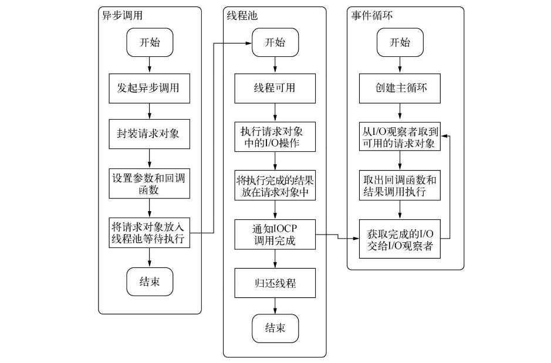
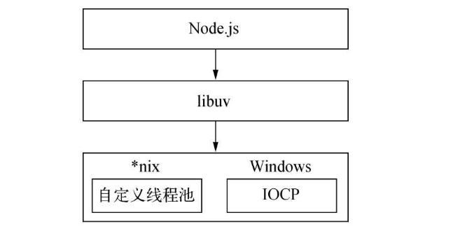
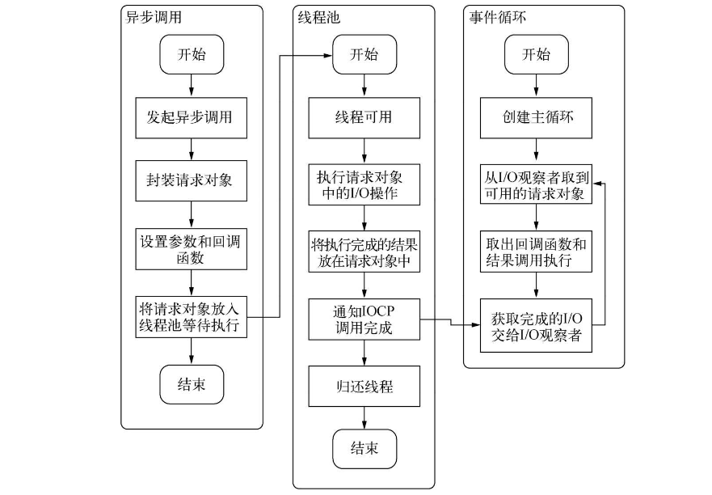
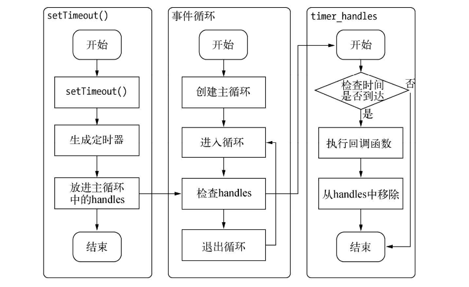
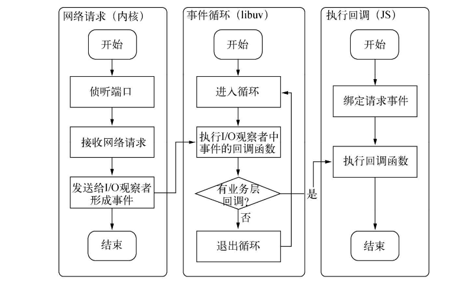

## Node引入模块

1. 路径分析
2. 文件定位
3. 编译执行

::: tip 

​		在node中，模块分为两类：核心模块（Node提供的模块）; 文件模块（用户编写的模块）

​		核心模块在Node源代码的编译中已经编译进了二进制执行文件。在node进程启动时，部分核心模块就被直接加载进内存中，这部分模块的引入省略了文件定位和编译执行的步骤。且在路径分析中是优先判断，加载速度最快。

​		文件模块是在运行时动态加载，需要完整的模块引入步骤。

:::


## CommonJs,AMD和CMD

::: tip 对比

- Node提出了commonJs的规范，基于此组织了自身的原生模块。

- CommonJs规范主要服务器端，NPM是对此规范的支持产物。
- AMD和CMD在浏览器环境

:::

模块写成对象，同时**立即执行函数**保证了外部无法访问内部私有变量

```js
var module = (function(){
    var star = 0;
    var f1 = function (){
        console.log('ok');
    };
    // IIFE只返回一个包含f1方法的对象
    return {
        f1
    };
})();
module.f1();  // ok
console.log(module.star)  // undefined 无法访问私有变量
```

以下参考阅读：https://www.jianshu.com/p/d67bc79976e6

### commonJs

::: tip commonJs

- 一个单独的文件就是一个模块。每一个模块都是一个单独的作用域，也就是说，在该模块内部定义的变量，无法被其他模块读取，除非定义为`global`对象的属性。
- 输出模块变量的最好方法是使用`module.exports`对象。
- 加载模块使用`require`方法，该方法读取一个文件并执行，返回文件内部的`module.exports`对象

::: 

```js
//   math.js
exports.add = function() {
    var sum = 0, i = 0, args = arguments, l = args.length;
    while (i < l) {
        sum += args[i++];
    }
    return sum;
};

//  increment.js
var add = require('math').add;
exports.increment = function(val) {
    return add(val, 1);
};

//  index.js
var increment = require('increment').increment;
var a = increment(1); //2
```

::: warning 浏览器端异步问题

-  `require` 是**同步**的。模块系统需要同步读取模块文件内容，并编译执行以得到模块接口。
   然而， 这在浏览器端问题多多。
- 浏览器端，加载 JavaScript 最佳、最容易的方式是在 `document` 中插入`script`标签。但脚本标签天生异步，传统 CommonJS 模块在浏览器环境中无法正常加载。
- 解决思路之一是，开发一个服务器端组件，对模块代码作静态分析，将模块与它的依赖列表一起返回给浏览器端。 这很好使，但需要服务器安装额外的组件，并因此要调整一系列底层架构。

:::

另一种解决思路是，用一套**标准模板**来封装模块定义：

```js
define(function(require, exports, module) {

  // The module code goes here

});
```

这套模板代码为模块加载器提供了机会，使其能在模块代码执行之前，对模块代码进行静态分析，并动态生成依赖列表。

```js
//  math.js
define(function(require, exports, module) {
  exports.add = function() {
    var sum = 0, i = 0, args = arguments, l = args.length;
    while (i < l) {
      sum += args[i++];
    }
    return sum;
  };
});

//  increment.js
define(function(require, exports, module) {
  var add = require('math').add;
  exports.increment = function(val) {
    return add(val, 1);
  };
});

//  index.js
define(function(require, exports, module) {
  var inc = require('increment').increment;
  inc(1); // 2
});
```

### AMD

::: tip AMD

1. AMD是`"Asynchronous Module Definition"`的缩写，意思就是"异步模块定义"。由于不是JavaScript原生支持，使用AMD规范进行页面开发需要用到对应的库函数，也就是大名鼎鼎`RequireJS`，实际上AMD 是 `RequireJS` 在推广过程中对模块定义的规范化的产出
2. 它采用异步方式加载模块，模块的加载不影响它后面语句的运行。所有依赖这个模块的语句，都定义在一个回调函数中，等到加载完成之后，这个回调函数才会运行。
3. `RequireJS`主要解决**两个问题**

- 多个js文件可能有依赖关系，被依赖的文件需要早于依赖它的文件加载到浏览器
- js加载的时候浏览器会停止页面渲染，加载文件越多，页面失去响应时间越长

:::

::: tip RequireJs

**RequireJs**也采用require()语句加载模块，但是不同于CommonJS，它要求两个参数:

1. 第一个参数[module]，是一个数组，里面的成员就是要加载的模块；
2. 第二个参数callback，则是加载成功之后的回调函数。math.add()与math模块加载不是同步的，浏览器不会发生假死。

:::

```ruby
require([module], callback);

require([increment'], function (increment) {
　   increment.add(1);
});
```

#### define()函数

​		`RequireJS`定义了一个函数 `define`，它是全局变量，用来定义模块:
 `define(id?, dependencies?, factory);`
::: tip  参数说明：

- id：指定义中模块的名字，可选；如果没有提供该参数，模块的名字应该默认为模块加载器请求的指定脚本的名字。如果提供了该参数，模块名必须是“顶级”的和绝对的（不允许相对名字）。
- 依赖dependencies：是一个当前模块依赖的，已被模块定义的模块标识的数组字面量。
   依赖参数是可选的，如果忽略此参数，它应该默认为["require", "exports", "module"]。然而，如果工厂方法的长度属性小于3，加载器会选择以函数的长度属性指定的参数个数调用工厂方法。
- 工厂方法factory，模块初始化要执行的函数或对象。如果为函数，它应该只被执行一次。如果是对象，此对象应该为模块的输出值。

:::

来举个🌰看看：

```js
define("alpha", ["require", "exports", "beta"], function (require, exports, beta) {
    exports.verb = function() {
        return beta.verb();
        //Or:
        return require("beta").verb();
    }
});
```

#### RequireJs使用例子

​		`require.config`是用来定义别名的，在paths属性下配置别名。然后通过`requirejs`(参数一，参数二)；参数一是数组，传入我们需要引用的模块名，第二个参数是个回调函数，回调函数传入一个变量，代替刚才所引入的模块。

```jsx
main.js
//别名配置
requirejs.config({
    paths: {
        jquery: 'jquery.min' //可以省略.js
    }
});
//引入模块，用变量$表示jquery模块
requirejs(['jquery'], function ($) {
    $('body').css('background-color','red');
});
```

​		引入模块也可以只写`require()`。`requirejs`通过`define()`定义模块，定义的参数上同。在此模块内的方法和变量外部是无法访问的，只有通过`return`返回才行.

```jsx
//  math.js
define('math',['jquery'], function ($) {//引入jQuery模块
    return {
        add: function(x,y){
            return x + y;
        }
    };
});
```

​		将该模块命名为math.js保存

```jsx
require(['jquery','math'], function ($,math) {
    console.log(math.add(10,100));//110
});
```

​		main.js引入模块方法

### CMD

::: tip CMD

​		CMD 即`Common Module Definition`通用模块定义，CMD规范是国内发展出来的，就像AMD有个`requireJS`，CMD有个浏览器的实现`SeaJS`，`SeaJS`要解决的问题和`requireJS`一样，只不过在模块定义方式和模块加载（可以说运行、解析）时机上有所不同。

::: 

在 CMD 规范中，一个模块就是一个文件。代码的书写格式如下:

```tsx
define(function(require, exports, module) {

  // 模块代码

});
```

​		`require`是可以把其他模块导入进来的一个参数;而`exports`是可以把模块内的一些属性和方法导出的;`module` 是一个对象，上面存储了与当前模块相关联的一些属性和方法。

- AMD是依赖关系前置,在定义模块的时候就要声明其依赖的模块;
- CMD是按需加载依赖就近,只有在用到某个模块的时候再去require：

```jsx
// CMD
define(function(require, exports, module) {
  var a = require('./a')
  a.doSomething()
  // 此处略去 100 行
  var b = require('./b') // 依赖可以就近书写
  b.doSomething()
  // ... 
})

// AMD 默认推荐的是
define(['./a', './b'], function(a, b) { // 依赖必须一开始就写好
  a.doSomething()
  // 此处略去 100 行
  b.doSomething()
  ...
}) 
```

#### seajs使用例子

```jsx
// 定义模块  myModule.js
define(function(require, exports, module) {
  var $ = require('jquery.js')
  $('div').addClass('active');
  exports.data = 1;
});

// 加载模块
seajs.use(['myModule.js'], function(my){
    var star= my.data;
    console.log(star);  //1
});
```

## 异步I/O

::: tip

- 伴随着异步I/O的还有事件驱动和单线程，它们构成Node的基调，Ryan Dahl正是基于这几个因素设计了Node
- 浏览器中JavaScript在单线程上执行，而且它还与UI渲染共用一个线程

:::

### 异步I/O与非阻塞I/O

::: tip

​		从实际效果而言，异步和非阻塞都达到了我们并行I/O的目的。但是从计算机内核I/O而言，异步/同步和阻塞/非阻塞实际上是两回事。

​		操作系统内核对于I/O只有两种方式：阻塞与非阻塞。

:::

- 阻塞I/O的一个特点是调用之后一定要等到系统内核层面完成所有操作后，调用才结束。以读取磁盘上的一段文件为例，系统内核在完成磁盘寻道、读取数据、复制数据到内存中之后，这个调用才结束。

  阻塞I/O造成CPU等待I/O，浪费等待时间，CPU的处理能力不能得到充分利用。为了提高性能，内核提供了非阻塞I/O。非阻塞I/O跟阻塞I/O的**差别**为**调用之后会立即返回**。

- 非阻塞I/O返回之后，CPU的时间片可以用来处理其他事务，此时的性能提升是明显的。
- 非阻塞带来的麻烦却是需要轮询去**确认**是否完全完成**数据获取**，它会让CPU处理状态判断，是对CPU资源的浪费

::: tip 完美的异步I/O

​		我们期望的完美的异步I/O应该是应用程序发起非阻塞调用，无须通过遍历或者事件唤醒等方式轮询，可以直接处理下一个任务，只需在I/O完成后通过信号或回调将数据传递给应用程序即可。

:::

### 现实的异步I/O

​		现实比理想要骨感一些，但是要达成异步I/O的目标，并非难事。前面我们将场景限定在了单线程的状况下，**多线程**的方式会是另一番风景。通过让部分线程进行阻塞I/O或者非阻塞I/O加轮询技术来完成数据获取，让一个线程进行计算处理，通过线程之间的通信将I/O得到的数据进行传递，这就轻松实现了异步I/O




​		Windows平台和*nix平台的差异，Node提供了libuv作为抽象封装层，使得所有平台兼容性的判断都由这一层来完成，并保证上层的Node与下层的自定义线程池及IOCP之间各自独立。Node在编译期间会判断平台条件，选择性编译unix目录或是win目录下的源文件到目标程序中，其架构如下图所示。



### Node的异步I/O

::: tip

- 整个异步I/O环节的有事件循环、观察者和请求对象
- JS发起异步调用，生成请求对象
- 线程池有线程可用时执行请求对象的I/O操作，完成通知IOCP
- I/O观察者获取到完成的I/O
- 事件循环查看I/O观察者，发现可用的（已完成的）请求对象取出结构执行回调

:::



​		从前面实现异步I/O的过程描述中，我们可以提取出异步I/O的几个关键词：**单线程**、**事件循环**、**观察者**和**I/O线程池**。这里单线程与I/O线程池之间看起来有些悖论的样子。由于我们知道JavaScript是单线程的，所以按常识很容易理解为它不能充分利用多核CPU。事实上，在Node中，除了JavaScript是单线程外，Node自身其实是多线程的，只是I/O线程使用的CPU较少。另一个需要重视的观点则是，除了用户代码无法并行执行外，所有的I/O（磁盘I/O和网络I/O等）则是可以并行起来的。

### 非I/O的异步API

#### 定时器

​		setTimeout()和setInterval()与浏览器中的API是一致的，分别用于单次和多次定时执行任务。它们的实现原理与异步I/O比较类似，只是不需要I/O线程池的参与。

​		调用setTimeout()或者setInterval()创建的定时器会被插入到**定时器观察者**内部的一个**红黑树**中。每次Tick执行时，会从该红黑树中迭代取出定时器对象，检查**是否超过定时时间**，如果超过，就形成一个事件，它的回调函数将立即执行。

​		定时器的问题在于，它**并非精确**的（在容忍范围内）。尽管事件循环十分快，但是如果某一次循环占用的时间较多，那么下次循环时，它也许已经超时很久了。譬如通过setTimeout()设定一个任务在10毫秒后执行，但是在9毫秒后，有一个任务占用了5毫秒的CPU时间片，再次轮到定时器执行时，时间就已经过期4毫秒。



#### process.nextTick()

​		每次调用process.nextTick()方法，只会将回调函数放入**队列**中，在下一轮Tick时取出执行。定时器中采用红黑树的操作时间复杂度为O(lg(n)), nextTick()的时间复杂度为O(1)。相较之下，process.nextTick()**更高效**。

#### setImmediate()

1. process.nextTick()中的回调函数执行的优先级要高于setImmediate()。这里的原因在于事件循环对观察者的检查是有先后顺序的，process.nextTick()属于idle观察者，setImmediate()属于check观察者。在每一个轮循环检查中，idle观察者先于I/O观察者，I/O观察者先于check观察者。（ idle观察者 > I/O观察者 > check观察者 ）
2. process.nextTick()的回调函数保存在一个数组中，setImmediate()的结果则是保存在**链表**中。
3. 链表的实现让setImmediate()在每个轮循环检查中只能**执行一个**。

```js
precess.nextTick(function(){
    console.log('precess.nextTick1延迟执行')
})
precess.nextTick(function(){
    console.log('precess.nextTick2延迟执行')
})
setImmediate(function(){
    console.log('setImmediate1延迟执行')
    // setImmediate执行一个，进入下一次循环，还是nextTick最先
    precess.nextTick(function(){
        console.log('强势插入')
    })
})
setImmediate(function(){
    console.log('setImmediate2延迟执行')
})
console.log('正常执行')
```

```
正常执行
precess.nextTick1延迟执行
precess.nextTick2延迟执行
setImmediate1延迟执行
强势插入
setImmediate2延迟执行
```

​		从执行结果上可以看出，当第一个setImmediate()的回调函数执行后，并没有立即执行第二个，而是进入了下一轮循环，再次按process.nextTick()优先、setImmediate()次后的顺序执行。之所以这样设计，是为了保证每轮循环能够较快地执行结束，防止CPU占用过多而阻塞后续I/O调用的情况。

### 事件驱动与高性能服务器

​		事件驱动：通过主循环加事件触发的方式来运行程序。

​		**事件循环**是异步实现的核心，它与浏览器中的执行模型基本保持了一致。

​		Node通过**事件驱动**的方式处理请求，无须为每一个请求创建额外的对应线程，可以省掉创建线程和销毁线程的开销，同时操作系统在调度任务时因为线程较少，上下文切换的代价很低。这使得服务器能够有条不紊地处理请求，即使在大量连接的情况下，也不受线程上下文切换开销的影响，这是Node高性能的一个原因



